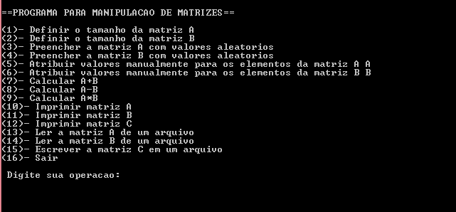

= Manual do Usuario
Autores: Bruna Liberato e Joao Vitor Lopes

Manual de utilizacao do programa de manipulacao de matrizes.

== Interface

Ao executar o programa, o usuario devera escolher as opcoes desejadas de acordo com a numeracao indicada no menu exibido. O programa permancerera em execucao ate que o usuario escolha a opcao 16 e saia do programa. Ate la ele deve escolher entre as opcoes de 1 a 15, e caso algo fora isso seja digitado o programa indicara o erro e ira pedir pra que o usuario digite uma das opcoes do menu.

== Matrizes

O programa manipula 3 matrizes: A, B e C. As matrizes A e B tem seu tamanho informado pelo usuario (opcoes 1 e 2) e podem sem preenchidas manualmente pelo usuario (opcoes 5 e 6) ou podem receber valores aleatorios (opcoes 3 e 4). A matriz C recebe os valores que resultam das operacoes realizadas com as matrizes A e B (opcoes 7, 8 e 9). Todas as matrizes sao armazenas em arquivos de texto, com localizacao definida pelo usuario. As matrizes podem ser exibidas atraves das opcoes 10, 11 e 12.

== Funcoes

* Preenchimento

O preenchimento das matrizes pode ocorrer de forma aleatoria ou manual. Atraves das opcoes 3 e 4 voce permite o programa preencha a matriz com valores aleatorios. Atraves das opcoes 5 e 6 voce atribui manualmente os valores para cada elemento da matriz.

* Operacoes com matrizes

Com as opcoes 7, 8 e 9 voce podera realizar operacoes com as matrizes. A opcao 7 realiza a soma, que somente e possivel caso as matrizes A e B tenham o mesmo tamanho. A opcao 8 realiza a subtracao, que tambem so e possivel caso as matrizes A e B tenham o mesmo tamanho. A opcao 9 realiza a multiplicacao, que apenas e possivel caso o numero de colunas da matriz A seja igual ao numero de linhas da matriz B. O proprio programa verifica se os tamanhos estao adequados e tambem informa o usuario caso esteja errado. Os resultados da ultima operacao relizada ficam armazenados na matriz C. 

* Exibir matrizes

As matrizes A, B e C sao lidas do arquivo e executadas no programa atraves das opcoes 10, 11 e 12.

* Manipulacao de arquivos 

Todas as matrizes sao salvas em arquivos de texto e tem sua localizacao e nome definidos pelo usuario.